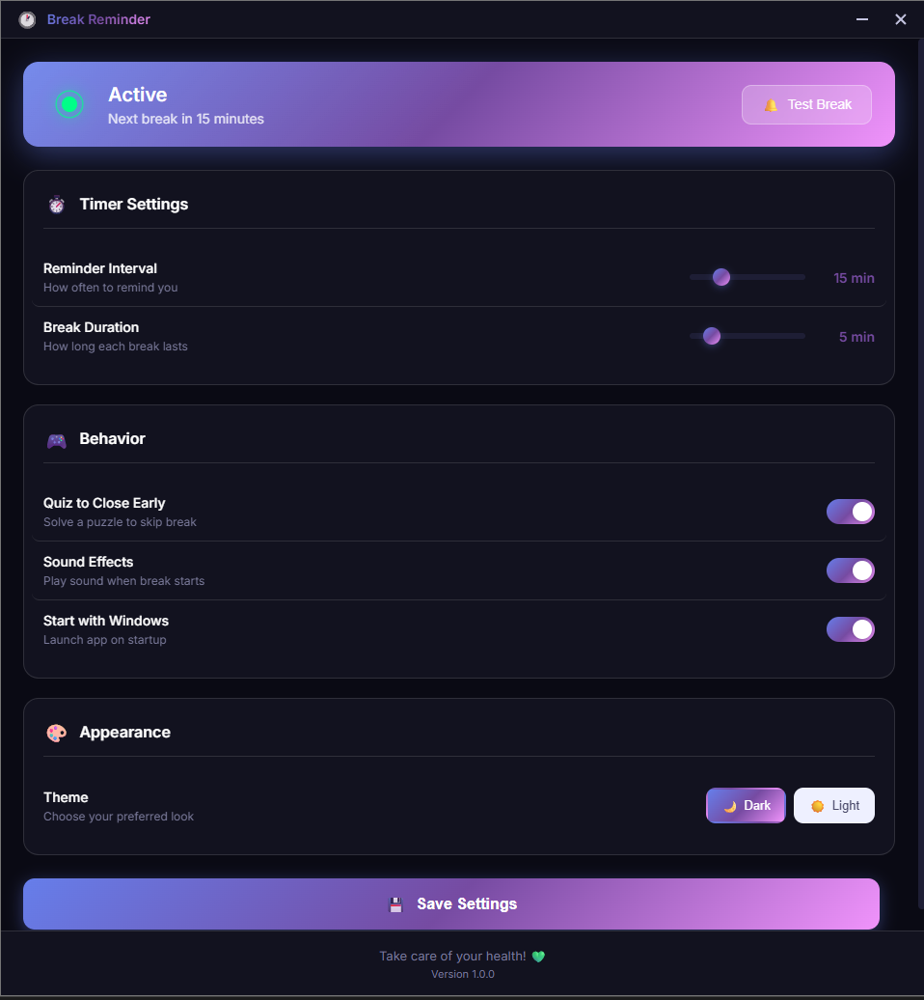

# 🧘 Break Reminder

A modern desktop application that reminds you to take breaks and rest your back. It covers your entire screen during breaks and requires solving a quiz to skip early!



## ✨ Features

- ⏰ **Customizable Timer**: Set your preferred reminder interval (1-60 minutes)
- 🛋️ **Break Duration**: Configure break length (1-30 minutes)
- 🖥️ **Fullscreen Overlay**: Covers your entire screen to ensure you take breaks
- 🧩 **Quiz to Skip**: Solve math, GK, riddles, or typing challenges to close early
- 🎨 **Modern UI**: Beautiful dark/light theme with smooth animations
- 📱 **System Tray**: Runs quietly in background with tray controls
- 💾 **Persistent Settings**: Your preferences are saved automatically

## 🚀 Getting Started

### Prerequisites

- [Node.js](https://nodejs.org/) (v16 or higher)
- npm (comes with Node.js)

### Installation

1. Clone or download this repository

2. Open terminal in the project folder and install dependencies:

   ```bash
   npm install
   ```

3. Start the application:

   ```bash
   npm start
   ```

### Building for Production

Build for Windows:

```bash
npm run build:win
```

Build for macOS:

```bash
npm run build:mac
```

Build for Linux:

```bash
npm run build:linux
```

## 🎮 How to Use

1. **Launch the app** - It will start minimized to system tray
2. **Configure Settings** - Click tray icon to open settings
3. **Set your preferences**:
   - Reminder Interval: How often you want to be reminded
   - Break Duration: How long each break should be
   - Quiz to Close: Enable/disable the quiz feature
4. **Save Settings** - Click the "Save Settings" button
5. **Work normally** - The app will remind you at set intervals

### During a Break

- The screen will be covered with a beautiful overlay
- A countdown timer shows remaining break time
- Health tips rotate to keep you motivated
- Wait for timer to finish, or...
- Click "Need to Skip?" to solve a quiz

### Quiz Types

- 🔢 **Math Challenges**: Solve arithmetic problems
- 🌍 **General Knowledge**: Answer trivia questions
- 🧩 **Brain Teasers**: Solve riddles
- ⌨️ **Typing Challenges**: Type words/phrases correctly

## ⚙️ Settings

| Setting | Description | Range |
|---------|-------------|-------|
| Reminder Interval | Time between breaks | 1-60 min |
| Break Duration | Length of each break | 1-30 min |
| Quiz to Close | Require quiz to skip break | On/Off |
| Sound Effects | Play sound when break starts | On/Off |
| Auto Start | Launch with Windows | On/Off |
| Theme | Dark or Light mode | Dark/Light |

## 🗂️ Project Structure

```
15 min timer/
├── package.json
├── README.md
├── assets/
│   ├── icon.svg
│   └── tray-icon.svg
└── src/
    ├── main.js              # Main Electron process
    └── renderer/
        ├── settings.html    # Settings window
        ├── reminder.html    # Fullscreen reminder
        ├── scripts/
        │   ├── settings.js  # Settings logic
        │   └── reminder.js  # Reminder & quiz logic
        └── styles/
            ├── settings.css # Settings styles
            └── reminder.css # Reminder styles
```

## 🛠️ Technologies

- **Electron** - Cross-platform desktop apps
- **HTML/CSS/JS** - Frontend
- **electron-store** - Persistent settings storage

## 📝 License

MIT License - feel free to use and modify!

## 💚 Health Tips

Remember:

- Stand up and stretch every 15-30 minutes
- Look away from screen every 20 minutes (20-20-20 rule)
- Stay hydrated
- Practice good posture
- Take short walks during longer breaks

---

Made with ❤️ for your health!
